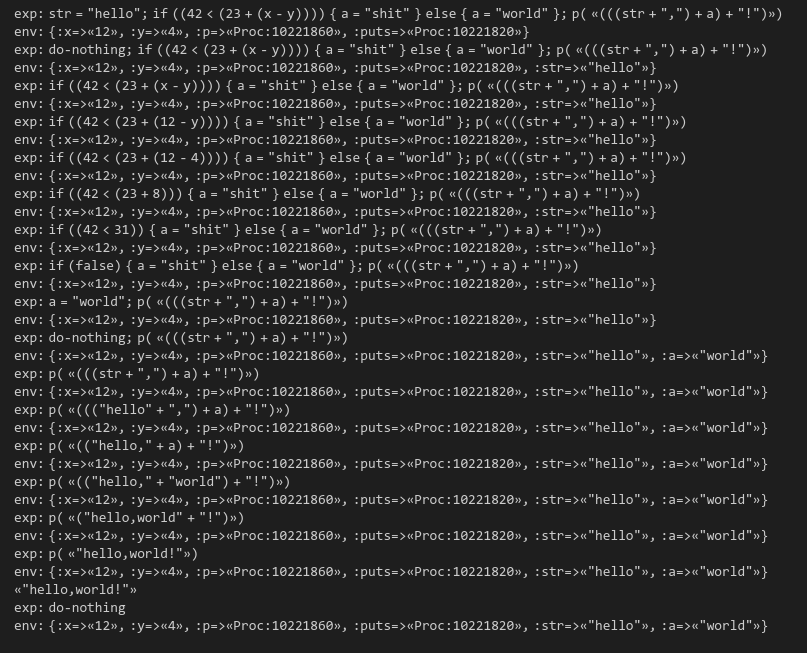

## Simple
讲解小步语义时，为演示规约过程而够造的一门示范性的编程语言。因为其重点在于程序如何解释和执行，所以没有前端部分，直接通过手写AST的方式来运行。


## Run
请确保已切换到 simple-lang 文件夹下。
### 交互式环境中运行
启动 ruby 的交互式环境
```shell
irb
```
载入 `syntax.rb`
```ruby
require './syntax'
Simple.machine(Simple.add(Simple.number(22), Simple.number(33)))
```

### 运行范例
```shell
ruby ./main.rb
``` 

## Syntax
### base type
数字：`Simple::Number.new(12)` 或者 `Simple.number(12)` 来创建。

字符串：`Simple::Str('hello shit!')` 或者 `Simple.string('hello shit!')` 来创建。

*未完成*

## TODO
* 增添函数的定义（目前只能调用通过env提供的已有的函数）。
* 更漂亮的输出（PrettyPrint）。